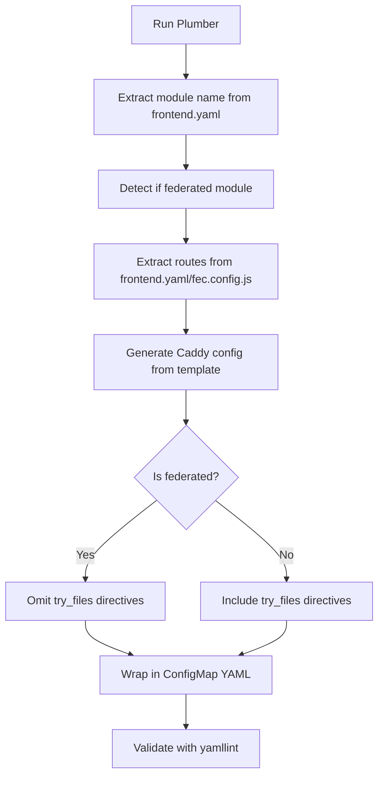

# Plumber Documentation for Claude

This file contains important context about Plumber's behavior and design decisions for AI assistants.

## Federated Modules vs Standalone Apps

Plumber generates Caddy configuration files for two types of applications:

### 1. Standalone Applications
- Have their own `index.html` file
- Use SPA (Single Page Application) routing
- Caddy should use `try_files {path} /index.html` to handle client-side routing
- Example: Traditional React apps that aren't federated

### 2. Federated Modules
- Part of the Module Federation architecture
- **Do NOT have index.html** - only serve `fed-mods.json` and JavaScript bundles
- Loaded dynamically by the Chrome shell at runtime
- Identified by `spec.module.manifestLocation` in `deploy/frontend.yaml`

### Critical Difference: try_files Behavior

**Standalone apps:** Need `try_files {path} /index.html` because:
- Browser requests `/my-app/some/route`
- Caddy should serve `/index.html` if the file doesn't exist
- index.html loads JavaScript which handles the route

**Federated modules:** Must NOT use `try_files {path} /index.html` because:
- There is no index.html to fall back to
- Only actual files (fed-mods.json, *.js bundles) should be served
- Requesting non-existent paths should return 404, not attempt to serve missing index.html
- The Chrome shell (not Caddy) handles routing for federated modules

### How Plumber Detects This

1. `is_federated_module()` checks for `spec.module.manifestLocation` in frontend.yaml
2. The `is_federated` flag is passed to the Jinja2 template
3. Template conditionally includes `try_files` only when `is_federated` is False:
   ```jinja2
   
   try_files {path} /index.html
   
   ```

## Module Name Extraction

Plumber automatically extracts the module name from `metadata.name` in frontend.yaml.

### Why This Matters

Repository names often differ from module names:
- Repository: `insights-rbac-ui`
- Module name: `rbac` (from metadata.name in Frontend object)

Using the wrong name causes mismatched routes:
- Wrong: `/apps/insights-rbac-ui*` (using repo name)
- Correct: `/apps/rbac*` (using module name)

### How It Works

1. `get_module_name_from_frontend_yaml()` extracts `metadata.name` from the Frontend object
2. This overrides the CLI `app_name` argument if found
3. Prevents mismatches when repo name differs from module name

## Chrome Shell Routes

Plumber automatically extracts and routes Chrome shell bundle mounts to the stage environment. This ensures that federated modules integrate correctly with the Chrome shell's navigation and bundle loading system.

### What Are Chrome Shell Routes?

Chrome shell routes are bundle mount points defined in `spec.module.modules[].routes[].pathname` that DO NOT start with `/apps/` or `/settings/`. These typically include:
- `/iam` - Identity and Access Management bundle
- `/insights` - Insights bundle
- `/settings` - Settings bundle (when not serving local assets)
- `/subscriptions` - Subscriptions bundle

Additionally, standard Chrome shell paths are always included:
- `/apps/chrome` - Chrome shell itself
- `/` - Root path
- `/index.html` - Main entry point

### How Chrome Shell Routes Work

In the proxy ConfigMap template:
```jinja2
{# Chrome shell routes - proxy to stage environment #}

handle {{ route_path }}* {
    reverse_proxy ${HCC_ENV_URL}
}

```

This ensures that:
1. Navigation to bundle routes (e.g., `/iam/my-user-access`) goes to Chrome shell
2. Chrome shell can load and orchestrate federated modules
3. Local app assets are still served from the local container

### CRITICAL: Caddy Environment Variable Syntax

**IMPORTANT:** Caddy uses `${VARIABLE_NAME}` syntax for environment variable substitution, NOT `{env.VARIABLE_NAME}`.

**Correct:**
```caddy
reverse_proxy ${HCC_ENV_URL}
```

**WRONG - DO NOT USE:**
```caddy
reverse_proxy {env.HCC_ENV_URL}  # ❌ This will NOT work in Caddy
```

This is standard Caddy syntax and must be preserved in the `proxy_caddy.template.j2` template. The proxy sidecar container will substitute `${HCC_ENV_URL}` with the actual stage environment URL at runtime.

**Why This Matters:**
- Using incorrect syntax (`{env.HCC_ENV_URL}`) will cause Caddy to fail to resolve the environment variable
- Chrome shell routes will not proxy correctly to the stage environment
- Navigation and federated module loading will break

### Extraction Function

`get_chrome_routes_from_frontend_yaml()` automatically:
1. Parses `spec.module.modules[].routes[].pathname` from frontend.yaml
2. Filters for routes that are NOT asset paths (using `_is_asset_path()`)
3. Adds standard Chrome shell paths (`/apps/chrome`, `/`, `/index.html`)
4. Returns unique list of Chrome shell routes

## Asset Path Detection

The `_is_asset_path()` helper function is critical for distinguishing between asset paths and Chrome shell bundle routes.

### Detection Logic

```python
def _is_asset_path(pathname: str) -> bool:
    """
    Determine if a pathname is an asset path that should route to the local app container.

    Asset paths are those that start with /apps/ or /settings/.
    Other paths (like /iam, /insights, etc.) are Chrome shell bundle mounts.
    """
    return pathname.startswith("/apps/") or pathname.startswith("/settings/")
```

### Examples

**Asset Paths** (route to local app on port 8000):
- `/apps/rbac`
- `/apps/insights-rbac-ui`
- `/settings/rbac`
- `/settings/my-app/config`

**Chrome Shell Bundle Routes** (route to stage environment):
- `/iam`
- `/insights`
- `/subscriptions`
- `/openshift`

This distinction is used by:
- `get_proxy_routes_from_frontend_yaml()` - Only returns asset paths
- `get_chrome_routes_from_frontend_yaml()` - Only returns non-asset paths

## Proxy Routes vs Navigation Routes

Plumber distinguishes between three types of routes in frontend.yaml:

### 1. Asset Routes (Proxy to Local App)
Routes that serve the actual application code and should be proxied to the local container (port 8000):
- `spec.frontend.paths[]` - e.g., `/apps/rbac`
- `spec.module.modules[].routes[].pathname` where pathname starts with `/apps/` or `/settings/`

These are extracted by `get_proxy_routes_from_frontend_yaml()` and used in the **proxy ConfigMap** to route to `127.0.0.1:8000`.

**Detection:** The helper function `_is_asset_path()` identifies asset paths by checking if they start with `/apps/` or `/settings/`.

### 2. Chrome Shell Bundle Routes (Proxy to Stage Environment)
Routes for Chrome shell bundle mounts that should be proxied to the stage environment:
- `spec.module.modules[].routes[].pathname` where pathname does NOT start with `/apps/` or `/settings/` (e.g., `/iam`, `/insights`)
- Standard Chrome paths: `/apps/chrome`, `/`, `/index.html`

These are extracted by `get_chrome_routes_from_frontend_yaml()` and used in the **proxy ConfigMap** to route to `${HCC_ENV_URL}`.

### 3. Navigation Routes (Not Proxied)
Routes that are menu/navigation links - these are NOT included in the proxy ConfigMap:
- `spec.searchEntries[].href` - e.g., `/iam/user-access/users`
- `spec.serviceTiles[].href` - e.g., `/iam/user-access/groups`
- `spec.bundleSegments[].navItems[].href` - e.g., `/iam/my-user-access`
- `spec.bundleSegments[].navItems[].routes[].href` - e.g., `/iam/access-management/roles`

These are included in the **app ConfigMap** (for reference) but excluded from the **proxy ConfigMap**. They fall through to the catch-all handler which routes to the stage environment.

### Why This Matters

**Problem (Before Fix):** If all routes are proxied to port 8000:
1. Browser requests `/iam/my-user-access` (navigation route)
2. Proxy sends it to port 8000 (app container)
3. Port 8000 serves static files from `/srv/dist` - no HTML exists for this navigation route
4. Browser gets empty `<html><head></head><body></body></html>`

**Solution (Current Implementation):** Separate asset paths, Chrome shell routes, and navigation routes:

**For asset paths** (e.g., `/apps/rbac/fed-mods.json`):
1. Browser requests `/apps/rbac/fed-mods.json`
2. Proxy matches asset route handler → routes to `127.0.0.1:8000`
3. Local app container serves the federated module manifest

**For Chrome shell bundle routes** (e.g., `/iam`):
1. Browser requests `/iam/my-user-access`
2. Proxy matches Chrome route handler (`/iam*`) → routes to `${HCC_ENV_URL}` (stage environment)
3. Stage environment's Chrome shell serves the HTML page with navigation
4. Chrome shell discovers federated module at `/apps/rbac/fed-mods.json`
5. Browser requests `/apps/rbac/fed-mods.json` → routed to local app (step above)

**For navigation routes** (e.g., `/iam/user-access/users`):
1. Browser requests `/iam/user-access/users`
2. Proxy matches Chrome route handler (`/iam*`) → routes to stage environment
3. Chrome shell serves the appropriate page

### Implementation

```python
# Extract all routes (for app ConfigMap - includes all navigation routes)
app_url_value = get_app_url_from_frontend_yaml(frontend_yaml_path)

# Extract asset routes (for proxy ConfigMap - /apps/*, /settings/*)
asset_routes = get_proxy_routes_from_frontend_yaml(frontend_yaml_path)

# Extract Chrome shell routes (for proxy ConfigMap - /iam, /apps/chrome, etc.)
chrome_routes = get_chrome_routes_from_frontend_yaml(frontend_yaml_path)
```

## ConfigMap Generation Process



## Template Variables

### App ConfigMap Template (`app_caddy.template.j2`)
- `app_name`: Module name (from metadata.name in frontend.yaml or CLI fallback)
- `app_urls`: List of all routes (from spec.frontend.paths + module routes + navigation routes)
- `is_federated`: Boolean flag indicating federated module
- `app_port`: Port number for the app container (default: "8000")

Note: app_name is primarily used for the /default* route and ConfigMap naming. All actual application routes come from app_urls (extracted from frontend.yaml), not hardcoded app_name patterns.

### Proxy ConfigMap Template (`proxy_caddy.template.j2`)
- `asset_routes`: List of asset paths to route to local app (e.g., `/apps/rbac`, `/settings/rbac`)
- `chrome_routes`: List of Chrome shell paths to route to stage environment (e.g., `/iam`, `/apps/chrome`)
- `app_port`: Port number for the app container (default: "8000")

## Common Issues

### Issue: Tests get empty HTML pages
**Cause:** Federated module ConfigMap has `try_files {path} /index.html` but no index.html exists
**Fix:** Regenerate ConfigMap with latest Plumber (which detects federated modules)

### Issue: Wrong route paths in ConfigMap
**Cause:** Plumber invoked with repository name instead of module name
**Fix:** Plumber now auto-extracts from frontend.yaml - just regenerate

### Issue: Duplicate routes in generated config
**Cause:** Previously had hardcoded `/apps/{{ app_name }}*` route plus dynamic routes from frontend.yaml
**Status:** ✅ Fixed - Removed hardcoded route since dynamic routes from frontend.yaml already cover it.

### Issue: Navigation routes (like /iam/*) return empty HTML
**Cause:** Proxy ConfigMap routes ALL paths (including navigation and Chrome shell routes) to port 8000, but port 8000 only serves static assets, not Chrome shell pages

**Fix:** ✅ Fixed - Plumber now separates routes into three categories:
1. **Asset routes** (`get_proxy_routes_from_frontend_yaml()`) - `/apps/*` and `/settings/*` paths that route to local app on port 8000
2. **Chrome shell routes** (`get_chrome_routes_from_frontend_yaml()`) - Bundle mounts like `/iam`, `/insights`, plus standard Chrome paths that route to stage environment
3. **Navigation routes** - Not included in proxy ConfigMap, handled by Chrome shell routes via pattern matching

The proxy ConfigMap now explicitly routes Chrome shell paths to `${HCC_ENV_URL}`, ensuring proper Chrome shell functionality.

### Issue: Chrome shell routes not working / environment variable not resolving
**Cause:** Template uses incorrect Caddy environment variable syntax `{env.HCC_ENV_URL}` instead of `${HCC_ENV_URL}`

**Symptoms:**
- Chrome shell navigation fails
- Routes to `/iam/*`, `/apps/chrome/*` don't load
- Caddy cannot resolve the stage environment URL

**Fix:** ✅ Fixed - Template now uses correct Caddy syntax `${HCC_ENV_URL}`

**CRITICAL:** The proxy ConfigMap template (`template/proxy_caddy.template.j2`) must use `${HCC_ENV_URL}` for environment variable substitution. This is standard Caddy syntax. Do NOT change this to `{env.HCC_ENV_URL}` as that will break environment variable resolution.

## Validation

### Federated Module Validation

Plumber now includes automatic validation to ensure federated modules don't contain `try_files` directives:

- **What it checks:** After generating the Caddyfile, validates that if `is_federated=True`, the config contains no `try_files` directives
- **When it runs:** Automatically during `generate_app_caddyfile()` execution
- **Error message:** Raises `ValueError` with clear explanation if validation fails
- **Why it matters:** Prevents the common error of federated modules trying to serve non-existent index.html files

This validation acts as a safety net to catch template bugs or regressions early, before the invalid config reaches production.

## Testing Changes

After modifying Plumber:

1. **Test with a standalone app:**
   ```bash
   uv run python main.py my-standalone-app \
     https://github.com/RedHatInsights/my-standalone-app.git \
     --app-configmap-name my-standalone-app-caddy-config \
     --proxy-configmap-name my-standalone-app-dev-proxy \
     --frontend-yaml path/to/frontend.yaml \
     --namespace rh-platform-experien-tenant
   ```
   Verify: Generated config SHOULD have `try_files {path} /index.html`

2. **Test with a federated module:**
   ```bash
   uv run python main.py rbac \
     https://github.com/RedHatInsights/insights-rbac-ui.git \
     --app-configmap-name insights-rbac-ui-app-caddy-config \
     --proxy-configmap-name insights-rbac-ui-dev-proxy-caddyfile \
     --frontend-yaml path/to/frontend.yaml \
     --namespace rh-platform-experien-tenant
   ```
   Verify: Generated config should NOT have any `try_files` or `rewrite / /index.html` directives

3. **Check console output:**
   - Should print "✓ Detected federated module" or "✓ Detected standalone app"
   - Should print "✓ Extracted module name from frontend.yaml: <name>"
   - Should show if module name differs from CLI app_name

## File Structure

```
plumber/
├── extraction/
│   └── __init__.py                    # Route extraction and detection functions:
│                                       # - get_app_url_from_frontend_yaml()
│                                       # - get_proxy_routes_from_frontend_yaml()
│                                       # - get_chrome_routes_from_frontend_yaml()
│                                       # - get_app_url_from_fec_config()
│                                       # - is_federated_module()
│                                       # - get_module_name_from_frontend_yaml()
│                                       # - _is_asset_path()
│                                       # - _extract_nav_item_hrefs()
├── generation/
│   └── __init__.py                    # ConfigMap generation functions:
│                                       # - generate_app_caddyfile()
│                                       # - generate_proxy_routes_caddyfile()
│                                       # - generate_app_caddy_configmap()
│                                       # - generate_proxy_caddy_configmap()
│                                       # - generate_configmap()
│                                       # - validate_yaml_file()
│                                       # - validate_federated_module_config()
├── template/
│   ├── app_caddy.template.j2          # App server config (conditional try_files based on is_federated)
│   └── proxy_caddy.template.j2        # Proxy routing (asset_routes + chrome_routes)
├── tests/                             # Test suite
│   ├── test_configmap_generation.py
│   ├── test_generate_frontend_proxy_caddyfile.py
│   └── test_proxy_caddy_template.py
├── main.py                            # CLI orchestration and main entry point
└── CLAUDE.md                          # This file
```

## Recent Improvements (Completed)

1. ✅ **Removed hardcoded /apps/{{ app_name }}* route** - All routes now extracted dynamically from frontend.yaml
2. ✅ **Chrome shell route separation** - Chrome shell bundle routes now explicitly routed to stage environment
3. ✅ **Asset path detection** - `_is_asset_path()` helper distinguishes `/apps/*` and `/settings/*` from bundle mounts
4. ✅ **Module name extraction from metadata.name** - Correctly extracts module name from Frontend object
5. ✅ **Validation for federated modules** - Ensures federated modules don't have try_files directives
6. ✅ **Tests added** - Test suite includes configmap generation and proxy routing tests

## Future Improvements

1. **Enhanced error handling** - More graceful handling of malformed or incomplete frontend.yaml files
2. **Dry-run mode** - Preview generated configs without writing files
3. **Config validation** - Validate generated Caddyfile syntax using Caddy itself
4. **Route conflict detection** - Warn if routes overlap or conflict
5. **Documentation generation** - Auto-generate route documentation from ConfigMaps
