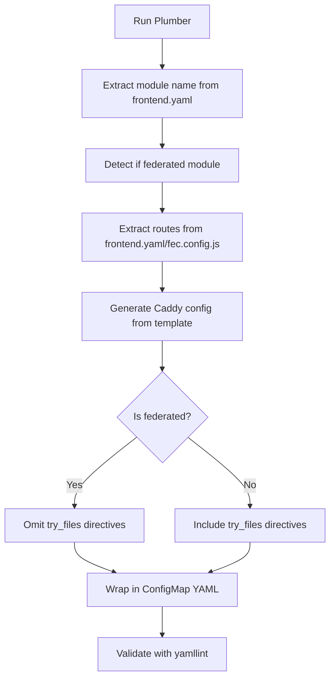

# Plumber Documentation for Claude

This file contains important context about Plumber's behavior and design decisions for AI assistants.

## Federated Modules vs Standalone Apps

Plumber generates Caddy configuration files for two types of applications:

### 1. Standalone Applications
- Have their own `index.html` file
- Use SPA (Single Page Application) routing
- Caddy should use `try_files {path} /index.html` to handle client-side routing
- Example: Traditional React apps that aren't federated

### 2. Federated Modules
- Part of the Module Federation architecture
- **Do NOT have index.html** - only serve `fed-mods.json` and JavaScript bundles
- Loaded dynamically by the Chrome shell at runtime
- Identified by `spec.module.manifestLocation` in `deploy/frontend.yaml`

### Critical Difference: try_files Behavior

**Standalone apps:** Need `try_files {path} /index.html` because:
- Browser requests `/my-app/some/route`
- Caddy should serve `/index.html` if the file doesn't exist
- index.html loads JavaScript which handles the route

**Federated modules:** Must NOT use `try_files {path} /index.html` because:
- There is no index.html to fall back to
- Only actual files (fed-mods.json, *.js bundles) should be served
- Requesting non-existent paths should return 404, not attempt to serve missing index.html
- The Chrome shell (not Caddy) handles routing for federated modules

### How Plumber Detects This

1. `is_federated_module()` checks for `spec.module.manifestLocation` in frontend.yaml
2. The `is_federated` flag is passed to the Jinja2 template
3. Template conditionally includes `try_files` only when `is_federated` is False:
   ```jinja2
   
   try_files {path} /index.html
   
   ```

## Module Name Extraction

Plumber now automatically extracts the module name from `spec.frontend.name` in frontend.yaml.

### Why This Matters

Repository names often differ from module names:
- Repository: `insights-rbac-ui`
- Module name: `rbac` (from spec.frontend.name)

Using the wrong name causes mismatched routes:
- Wrong: `/apps/insights-rbac-ui*` (using repo name)
- Correct: `/apps/rbac*` (using module name)

### How It Works

1. `get_module_name_from_frontend_yaml()` extracts `spec.frontend.name`
2. This overrides the CLI `app_name` argument if found
3. Prevents mismatches when repo name differs from module name

## ConfigMap Generation Process



## Template Variables

The `app_caddy.template.j2` template receives:
- `app_name`: Module name (from metadata.name in frontend.yaml or CLI fallback)
- `app_urls`: List of routes (from spec.frontend.paths + module routes)
- `is_federated`: Boolean flag indicating federated module

Note: app_name is primarily used for the /default* route and ConfigMap naming. All actual
application routes come from app_urls (extracted from frontend.yaml), not hardcoded app_name patterns.

## Common Issues

### Issue: Tests get empty HTML pages
**Cause:** Federated module ConfigMap has `try_files {path} /index.html` but no index.html exists
**Fix:** Regenerate ConfigMap with latest Plumber (which detects federated modules)

### Issue: Wrong route paths in ConfigMap
**Cause:** Plumber invoked with repository name instead of module name
**Fix:** Plumber now auto-extracts from frontend.yaml - just regenerate

### Issue: Duplicate routes in generated config
**Cause:** Previously had hardcoded `/apps/{{ app_name }}*` route plus dynamic routes from frontend.yaml
**Status:** ✅ Fixed - Removed hardcoded route since dynamic routes from frontend.yaml already cover it.

## Testing Changes

After modifying Plumber:

1. **Test with a standalone app:**
   ```bash
   uv run python main.py my-standalone-app \
     https://github.com/RedHatInsights/my-standalone-app.git \
     --app-configmap-name my-standalone-app-caddy-config \
     --proxy-configmap-name my-standalone-app-dev-proxy \
     --frontend-yaml path/to/frontend.yaml \
     --namespace rh-platform-experien-tenant
   ```
   Verify: Generated config SHOULD have `try_files {path} /index.html`

2. **Test with a federated module:**
   ```bash
   uv run python main.py rbac \
     https://github.com/RedHatInsights/insights-rbac-ui.git \
     --app-configmap-name insights-rbac-ui-app-caddy-config \
     --proxy-configmap-name insights-rbac-ui-dev-proxy-caddyfile \
     --frontend-yaml path/to/frontend.yaml \
     --namespace rh-platform-experien-tenant
   ```
   Verify: Generated config should NOT have any `try_files` or `rewrite / /index.html` directives

3. **Check console output:**
   - Should print "✓ Detected federated module" or "✓ Detected standalone app"
   - Should print "✓ Extracted module name from frontend.yaml: <name>"
   - Should show if module name differs from CLI app_name

## File Structure

```
plumber/
├── extraction/
│   └── __init__.py          # is_federated_module(), get_module_name_from_frontend_yaml()
├── generation/
│   └── __init__.py          # generate_app_caddyfile(), generate_app_caddy_configmap()
├── template/
│   ├── app_caddy.template.j2     # Conditional try_files based on is_federated
│   └── proxy_caddy.template.j2   # Proxy routing (no try_files logic needed)
├── main.py                  # Orchestrates detection and generation
└── CLAUDE.md               # This file
```

## Future Improvements

1. **Remove hardcoded /apps/{{ app_name }}* route** - Dynamic routes from frontend.yaml already cover this
2. **Add tests** - Unit tests for is_federated_module() and get_module_name_from_frontend_yaml()
3. **Better error handling** - Gracefully handle malformed frontend.yaml files
4. **Chrome shell integration** - Consider how ConfigMaps interact with Chrome shell expectations
