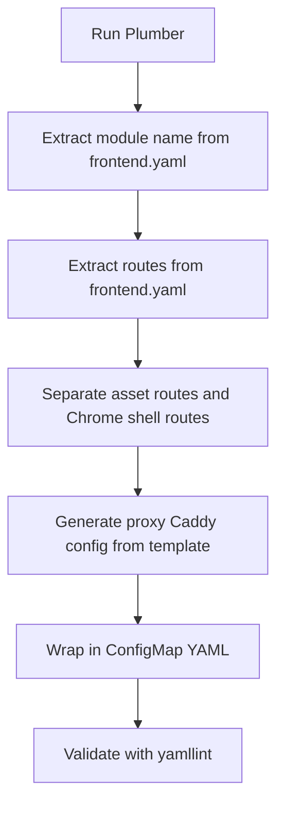

# Plumber Documentation for Claude

This file contains important context about Plumber's behavior and design decisions for AI assistants.

## Important Note: App ConfigMaps Removed

As of the latest version, Plumber **only generates proxy ConfigMaps**. App ConfigMap generation has been removed as it is no longer needed in the new test pipeline. The app container serves static files directly without requiring a custom Caddy configuration.

## Architecture: Proxy-Only Configuration

Plumber generates a single proxy ConfigMap that handles all routing:

### Proxy ConfigMap
- Routes requests to appropriate destinations:
  - **Asset routes** → `127.0.0.1:8000` (local app container serving static files)
  - **Chrome shell routes** → Direct URL to stage environment
- Uses direct URL substitution at generation time (no environment variables)
- Handles all routing logic for the development environment

### Why This Design?

The proxy is the single source of routing logic. The app container on port 8000 serves static files directly from `/srv/dist` without custom Caddy configuration. This simplifies the architecture:
- Proxy controls which requests go to local vs stage environment
- App container has no routing complexity - just serves files
- All routing decisions are centralized in the proxy ConfigMap

## Module Name Extraction

Plumber automatically extracts the module name from `metadata.name` in frontend.yaml.

### Why This Matters

Repository names often differ from module names:
- Repository: `insights-rbac-ui`
- Module name: `rbac` (from metadata.name in Frontend object)

Using the wrong name causes mismatched routes:
- Wrong: `/apps/insights-rbac-ui*` (using repo name)
- Correct: `/apps/rbac*` (using module name)

### How It Works

1. `get_module_name_from_frontend_yaml()` extracts `metadata.name` from the Frontend object
2. This overrides the CLI `app_name` argument if found
3. Prevents mismatches when repo name differs from module name

## Chrome Shell Routes

Plumber automatically extracts and routes Chrome shell bundle mounts to the stage environment. This ensures that federated modules integrate correctly with the Chrome shell's navigation and bundle loading system.

### What Are Chrome Shell Routes?

Chrome shell routes are bundle mount points defined in `spec.module.modules[].routes[].pathname` that DO NOT start with `/apps/` or `/settings/`. These typically include:
- `/iam` - Identity and Access Management bundle
- `/insights` - Insights bundle
- `/settings` - Settings bundle (when not serving local assets)
- `/subscriptions` - Subscriptions bundle

Additionally, standard Chrome shell paths are always included:
- `/apps/chrome` - Chrome shell itself
- `/` - Root path
- `/index.html` - Main entry point

### How Chrome Shell Routes Work

In the proxy ConfigMap template:
```jinja2
{# Chrome shell routes - proxy to stage environment #}

handle {{ route_path }}* {
    reverse_proxy {{ stage_env_url }}
}

```

This ensures that:
1. Navigation to bundle routes (e.g., `/iam/my-user-access`) goes to Chrome shell
2. Chrome shell can load and orchestrate federated modules
3. Local app assets are still served from the local container

### CRITICAL: Direct URL Substitution (No Environment Variables)

**IMPORTANT:** Plumber uses **direct URL substitution** at generation time, NOT Caddy environment variables.

**How it works:**
```bash
# User provides stage URL via CLI argument
uv run python main.py rbac ... --stage-env-url https://console.stage.redhat.com
```

**Generated output:**
```caddy
handle /iam* {
    reverse_proxy https://console.stage.redhat.com
}
```

**Why This Matters:**
- No reliance on Caddy's environment variable resolution
- The URL is directly embedded in the ConfigMap at generation time
- Eliminates all environment variable syntax issues
- ConfigMaps are self-contained and ready to deploy
- The `--stage-env-url` argument is **REQUIRED** when Chrome routes are present

### Extraction Function

`get_chrome_routes_from_frontend_yaml()` automatically:
1. Parses `spec.module.modules[].routes[].pathname` from frontend.yaml
2. Filters for routes that are NOT asset paths (using `_is_asset_path()`)
3. Adds standard Chrome shell paths (`/apps/chrome`, `/`, `/index.html`)
4. Returns unique list of Chrome shell routes

## Asset Path Detection

The `_is_asset_path()` helper function is critical for distinguishing between asset paths and Chrome shell bundle routes.

### Detection Logic

```python
def _is_asset_path(pathname: str) -> bool:
    """
    Determine if a pathname is an asset path that should route to the local app container.

    Asset paths are those that start with /apps/ or /settings/.
    Other paths (like /iam, /insights, etc.) are Chrome shell bundle mounts.
    """
    return pathname.startswith("/apps/") or pathname.startswith("/settings/")
```

### Examples

**Asset Paths** (route to local app on port 8000):
- `/apps/rbac`
- `/apps/insights-rbac-ui`
- `/settings/rbac`
- `/settings/my-app/config`

**Chrome Shell Bundle Routes** (route to stage environment):
- `/iam`
- `/insights`
- `/subscriptions`
- `/openshift`

This distinction is used by:
- `get_proxy_routes_from_frontend_yaml()` - Only returns asset paths
- `get_chrome_routes_from_frontend_yaml()` - Only returns non-asset paths

## Proxy Routes vs Navigation Routes

Plumber distinguishes between three types of routes in frontend.yaml:

### 1. Asset Routes (Proxy to Local App)
Routes that serve the actual application code and should be proxied to the local container (port 8000):
- `spec.frontend.paths[]` - e.g., `/apps/rbac`
- `spec.module.modules[].routes[].pathname` where pathname starts with `/apps/` or `/settings/`

These are extracted by `get_proxy_routes_from_frontend_yaml()` and used in the **proxy ConfigMap** to route to `127.0.0.1:8000`.

**Detection:** The helper function `_is_asset_path()` identifies asset paths by checking if they start with `/apps/` or `/settings/`.

### 2. Chrome Shell Bundle Routes (Proxy to Stage Environment)
Routes for Chrome shell bundle mounts that should be proxied to the stage environment:
- `spec.module.modules[].routes[].pathname` where pathname does NOT start with `/apps/` or `/settings/` (e.g., `/iam`, `/insights`)
- Standard Chrome paths: `/apps/chrome`, `/`, `/index.html`

These are extracted by `get_chrome_routes_from_frontend_yaml()` and used in the **proxy ConfigMap** to route to the stage environment URL (provided via `--stage-env-url`).

### 3. Navigation Routes (Not Proxied)
Routes that are menu/navigation links - these are NOT included in the proxy ConfigMap:
- `spec.searchEntries[].href` - e.g., `/iam/user-access/users`
- `spec.serviceTiles[].href` - e.g., `/iam/user-access/groups`
- `spec.bundleSegments[].navItems[].href` - e.g., `/iam/my-user-access`
- `spec.bundleSegments[].navItems[].routes[].href` - e.g., `/iam/access-management/roles`

These are excluded from the **proxy ConfigMap**. They fall through to the catch-all handler which routes to the stage environment.

### Why This Matters

**Problem (Before Fix):** If all routes are proxied to port 8000:
1. Browser requests `/iam/my-user-access` (navigation route)
2. Proxy sends it to port 8000 (app container)
3. Port 8000 serves static files from `/srv/dist` - no HTML exists for this navigation route
4. Browser gets empty `<html><head></head><body></body></html>`

**Solution (Current Implementation):** Separate asset paths, Chrome shell routes, and navigation routes:

**For asset paths** (e.g., `/apps/rbac/fed-mods.json`):
1. Browser requests `/apps/rbac/fed-mods.json`
2. Proxy matches asset route handler → routes to `127.0.0.1:8000`
3. Local app container serves the federated module manifest

**For Chrome shell bundle routes** (e.g., `/iam`):
1. Browser requests `/iam/my-user-access`
2. Proxy matches Chrome route handler (`/iam*`) → routes to stage environment (direct URL)
3. Stage environment's Chrome shell serves the HTML page with navigation
4. Chrome shell discovers federated module at `/apps/rbac/fed-mods.json`
5. Browser requests `/apps/rbac/fed-mods.json` → routed to local app (step above)

**For navigation routes** (e.g., `/iam/user-access/users`):
1. Browser requests `/iam/user-access/users`
2. Proxy matches Chrome route handler (`/iam*`) → routes to stage environment
3. Chrome shell serves the appropriate page

### Implementation

```python
# Extract asset routes (for proxy ConfigMap - /apps/*, /settings/*)
asset_routes = get_proxy_routes_from_frontend_yaml(frontend_yaml_path)

# Extract Chrome shell routes (for proxy ConfigMap - /iam, /apps/chrome, etc.)
chrome_routes = get_chrome_routes_from_frontend_yaml(frontend_yaml_path)
```

## ConfigMap Generation Process


```mermaid
graph TD
    A[Run Plumber] --> B[Extract module name from frontend.yaml]
    B --> C[Extract routes from frontend.yaml]
    C --> D[Separate asset routes and Chrome shell routes]
    D --> E[Generate proxy Caddy config from template]
    E --> F[Wrap in ConfigMap YAML]
    F --> G[Validate with yamllint]
```

## Template Variables

### Proxy ConfigMap Template (`proxy_caddy.template.j2`)
- `asset_routes`: List of asset paths to route to local app (e.g., `/apps/rbac`, `/settings/rbac`)
- `chrome_routes`: List of Chrome shell paths to route to stage environment (e.g., `/iam`, `/apps/chrome`)
- `stage_env_url`: Direct URL to stage environment (e.g., `https://console.stage.redhat.com`)
- `app_port`: Port number for the app container (default: "8000")

## Common Issues

### Issue: Wrong route paths in ConfigMap
**Cause:** Plumber invoked with repository name instead of module name
**Fix:** Plumber now auto-extracts from frontend.yaml - just regenerate

### Issue: Navigation routes (like /iam/*) return empty HTML
**Cause:** Proxy ConfigMap routes ALL paths (including navigation and Chrome shell routes) to port 8000, but port 8000 only serves static assets, not Chrome shell pages

**Fix:** ✅ Fixed - Plumber now separates routes into three categories:
1. **Asset routes** (`get_proxy_routes_from_frontend_yaml()`) - `/apps/*` and `/settings/*` paths that route to local app on port 8000
2. **Chrome shell routes** (`get_chrome_routes_from_frontend_yaml()`) - Bundle mounts like `/iam`, `/insights`, plus standard Chrome paths that route to stage environment
3. **Navigation routes** - Not included in proxy ConfigMap, handled by Chrome shell routes via pattern matching

The proxy ConfigMap now explicitly routes Chrome shell paths to the stage environment URL (embedded directly at generation time), ensuring proper Chrome shell functionality.

## Testing Changes

After modifying Plumber, test with a typical module:

```bash
uv run python main.py rbac \
  https://github.com/RedHatInsights/insights-rbac-ui.git \
  --proxy-configmap-name insights-rbac-ui-dev-proxy-caddyfile \
  --frontend-yaml path/to/frontend.yaml \
  --stage-env-url https://console.stage.redhat.com \
  --namespace rh-platform-experien-tenant
```

Verify generated proxy ConfigMap:
- Contains asset route handlers for `/apps/*` and `/settings/*` paths
- Routes asset paths to `127.0.0.1:8000`
- Contains Chrome shell route handlers for bundle mounts
- Routes Chrome shell paths to the stage environment URL
- Module name extracted from frontend.yaml is used correctly

## File Structure

```
plumber/
├── extraction/
│   └── __init__.py                    # Route extraction and detection functions:
│                                       # - get_proxy_routes_from_frontend_yaml()
│                                       # - get_chrome_routes_from_frontend_yaml()
│                                       # - get_module_name_from_frontend_yaml()
│                                       # - _is_asset_path()
├── generation/
│   └── __init__.py                    # ConfigMap generation functions:
│                                       # - generate_proxy_routes_caddyfile()
│                                       # - generate_proxy_caddy_configmap()
│                                       # - generate_configmap()
│                                       # - validate_yaml_file()
├── template/
│   └── proxy_caddy.template.j2        # Proxy routing (asset_routes + chrome_routes)
├── tests/                             # Test suite
│   ├── test_generate_frontend_proxy_caddyfile.py
│   └── test_proxy_caddy_template.py
├── main.py                            # CLI orchestration and main entry point
└── CLAUDE.md                          # This file
```

## Recent Improvements (Completed)

1. ✅ **Removed app ConfigMap generation** - Simplified architecture to only generate proxy ConfigMaps
2. ✅ **Chrome shell route separation** - Chrome shell bundle routes now explicitly routed to stage environment
3. ✅ **Asset path detection** - `_is_asset_path()` helper distinguishes `/apps/*` and `/settings/*` from bundle mounts
4. ✅ **Module name extraction from metadata.name** - Correctly extracts module name from Frontend object
5. ✅ **Direct URL substitution** - Stage environment URLs are embedded at generation time, not via environment variables
6. ✅ **Tests added** - Test suite includes proxy routing tests

## Future Improvements

1. **Enhanced error handling** - More graceful handling of malformed or incomplete frontend.yaml files
2. **Dry-run mode** - Preview generated configs without writing files
3. **Config validation** - Validate generated Caddyfile syntax using Caddy itself
4. **Route conflict detection** - Warn if routes overlap or conflict
5. **Documentation generation** - Auto-generate route documentation from ConfigMaps
