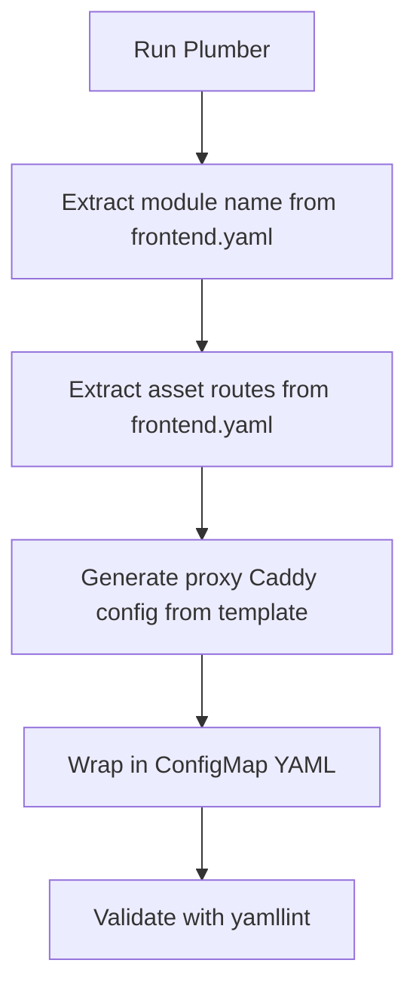

# Plumber Documentation for Claude

This file contains important context about Plumber's behavior and design decisions for AI assistants.

## Important Note: App ConfigMaps Removed

As of the latest version, Plumber **only generates proxy ConfigMaps**. App ConfigMap generation has been removed as it is no longer needed in the new test pipeline. The app container serves static files directly without requiring a custom Caddy configuration.

## Architecture: Proxy-Only Configuration

Plumber generates a single proxy ConfigMap that handles routing for asset paths only:

### Proxy ConfigMap
- Routes asset requests to the local app container:
  - **Asset routes** (paths starting with `/apps/` or `/settings/`) → `127.0.0.1:8000`
- Only includes routes that serve local application code
- Does NOT include Chrome shell routes or navigation routes

### Why This Design?

The proxy ConfigMap only handles routing for the application's own assets. The app container on port 8000 serves static files directly from `/srv/dist` without custom Caddy configuration. This simplified architecture:
- Proxy routes only asset requests to the local container
- App container serves files without routing complexity
- Chrome shell and navigation are handled by the test environment itself

## Module Name Extraction

Plumber automatically extracts the module name from `metadata.name` in frontend.yaml.

### Why This Matters

Repository names often differ from module names:
- Repository: `insights-rbac-ui`
- Module name: `rbac` (from metadata.name in Frontend object)

Using the wrong name causes mismatched routes:
- Wrong: `/apps/insights-rbac-ui*` (using repo name)
- Correct: `/apps/rbac*` (using module name)

### How It Works

1. `get_module_name_from_frontend_yaml()` extracts `metadata.name` from the Frontend object
2. This overrides the CLI `app_name` argument if found
3. Prevents mismatches when repo name differs from module name

## Route Extraction

Plumber extracts routes from `frontend.yaml` but only generates proxy ConfigMaps for asset routes.

### Asset Routes (Included in Proxy ConfigMap)

Asset routes are paths that start with `/apps/` or `/settings/` and serve the local application code:
- Defined in `spec.frontend.paths[]` (e.g., `/apps/rbac`)
- Defined in `spec.module.modules[].routes[].pathname` where pathname starts with `/apps/` or `/settings/`

These routes are:
1. Extracted by `get_proxy_routes_from_frontend_yaml()`
2. Included in the proxy ConfigMap
3. Routed to `127.0.0.1:8000` (local app container)

### Chrome Shell and Navigation Routes (NOT Included)

Other routes extracted from `frontend.yaml` are NOT included in the proxy ConfigMap:
- **Chrome shell bundle mounts**: Routes like `/iam`, `/insights` that don't start with `/apps/` or `/settings/`
- **Navigation routes**: Menu links from `searchEntries`, `serviceTiles`, `bundleSegments`

These routes are handled by the test environment and Chrome shell, not by Plumber's proxy ConfigMap.

### Extraction Functions

- `get_proxy_routes_from_frontend_yaml()`: Extracts asset routes for the proxy ConfigMap
- `get_chrome_routes_from_frontend_yaml()`: Available for reference but not used in proxy generation
- `_is_asset_path()`: Helper to identify asset paths (starts with `/apps/` or `/settings/`)

## Asset Path Detection

The `_is_asset_path()` helper function is critical for distinguishing between asset paths and Chrome shell bundle routes.

### Detection Logic

```python
def _is_asset_path(pathname: str) -> bool:
    """
    Determine if a pathname is an asset path that should route to the local app container.

    Asset paths are those that start with /apps/ or /settings/.
    Other paths (like /iam, /insights, etc.) are Chrome shell bundle mounts.
    """
    return pathname.startswith("/apps/") or pathname.startswith("/settings/")
```

### Examples

**Asset Paths** (included in proxy ConfigMap, route to local app on port 8000):
- `/apps/rbac`
- `/apps/insights-rbac-ui`
- `/settings/rbac`
- `/settings/my-app/config`

**Chrome Shell Bundle Routes** (NOT included in proxy ConfigMap, handled by test environment):
- `/iam`
- `/insights`
- `/subscriptions`
- `/openshift`

This distinction is used by:
- `get_proxy_routes_from_frontend_yaml()` - Returns only asset paths for proxy ConfigMap
- `get_chrome_routes_from_frontend_yaml()` - Available for reference but not used in proxy generation

## Proxy Routes vs Navigation Routes

Plumber extracts routes from frontend.yaml but only includes asset routes in the proxy ConfigMap:

### 1. Asset Routes (Included in Proxy ConfigMap)
Routes that serve the actual application code and are proxied to the local container (port 8000):
- `spec.frontend.paths[]` - e.g., `/apps/rbac`
- `spec.module.modules[].routes[].pathname` where pathname starts with `/apps/` or `/settings/`

These are extracted by `get_proxy_routes_from_frontend_yaml()` and **included in the proxy ConfigMap** to route to `127.0.0.1:8000`.

**Detection:** The helper function `_is_asset_path()` identifies asset paths by checking if they start with `/apps/` or `/settings/`.

### 2. Chrome Shell Bundle Routes (NOT in Proxy ConfigMap)
Routes for Chrome shell bundle mounts that do NOT start with `/apps/` or `/settings/`:
- `spec.module.modules[].routes[].pathname` (e.g., `/iam`, `/insights`)
- Standard Chrome paths: `/apps/chrome`, `/`, `/index.html`

These are **NOT included in the proxy ConfigMap**. The test environment handles routing for these paths.

### 3. Navigation Routes (NOT in Proxy ConfigMap)
Routes that are menu/navigation links:
- `spec.searchEntries[].href` - e.g., `/iam/user-access/users`
- `spec.serviceTiles[].href` - e.g., `/iam/user-access/groups`
- `spec.bundleSegments[].navItems[].href` - e.g., `/iam/my-user-access`
- `spec.bundleSegments[].navItems[].routes[].href` - e.g., `/iam/access-management/roles`

These are **NOT included in the proxy ConfigMap**. The test environment handles navigation.

### Why This Matters

The proxy ConfigMap only routes asset paths to the local container. All other routing (Chrome shell, navigation) is handled by the test environment:

**For asset paths** (e.g., `/apps/rbac/fed-mods.json`):
1. Browser requests `/apps/rbac/fed-mods.json`
2. Proxy matches asset route handler → routes to `127.0.0.1:8000`
3. Local app container serves the federated module manifest

**For other paths** (e.g., `/iam/my-user-access`):
1. Browser requests `/iam/my-user-access`
2. Test environment handles routing (not in proxy ConfigMap)
3. Chrome shell serves the appropriate page

### Implementation

```python
# Extract asset routes (for proxy ConfigMap - /apps/*, /settings/*)
asset_routes = get_proxy_routes_from_frontend_yaml(frontend_yaml_path)
```

## ConfigMap Generation Process


```mermaid
graph TD
    A[Run Plumber] --> B[Extract module name from frontend.yaml]
    B --> C[Extract asset routes from frontend.yaml]
    C --> D[Generate proxy Caddy config from template]
    D --> E[Wrap in ConfigMap YAML]
    E --> F[Validate with yamllint]
```

## Template Variables

### Proxy ConfigMap Template (`proxy_caddy.template.j2`)
- `asset_routes`: List of asset paths to route to local app (e.g., `/apps/rbac`, `/settings/rbac`)
- `app_port`: Port number for the app container (default: "8000")

## Common Issues

### Issue: Wrong route paths in ConfigMap
**Cause:** Plumber invoked with repository name instead of module name
**Fix:** Plumber now auto-extracts from frontend.yaml - just regenerate

### Issue: Navigation routes (like /iam/*) return empty HTML
**Cause:** Proxy ConfigMap routes ALL paths (including navigation and Chrome shell routes) to port 8000, but port 8000 only serves static assets, not Chrome shell pages

**Fix:** ✅ Fixed - Plumber now only includes asset routes in the proxy ConfigMap:
1. **Asset routes** (`get_proxy_routes_from_frontend_yaml()`) - `/apps/*` and `/settings/*` paths that route to local app on port 8000
2. **Chrome shell routes** - NOT included in proxy ConfigMap; handled by test environment
3. **Navigation routes** - NOT included in proxy ConfigMap; handled by test environment

The proxy ConfigMap only routes asset paths to the local container. The test environment handles all other routing (Chrome shell, navigation, etc.).

## Testing Changes

After modifying Plumber, test with a typical module:

```bash
uv run python main.py rbac \
  https://github.com/RedHatInsights/insights-rbac-ui.git \
  --proxy-configmap-name insights-rbac-ui-dev-proxy-caddyfile \
  --frontend-yaml path/to/frontend.yaml \
  --namespace rh-platform-experien-tenant
```

Verify generated proxy ConfigMap:
- Contains ONLY asset route handlers for `/apps/*` and `/settings/*` paths
- Routes asset paths to `127.0.0.1:8000`
- Does NOT contain Chrome shell routes or navigation routes
- Module name extracted from frontend.yaml is used correctly

## File Structure

```
plumber/
├── extraction/
│   └── __init__.py                    # Route extraction and detection functions:
│                                       # - get_proxy_routes_from_frontend_yaml()
│                                       # - get_chrome_routes_from_frontend_yaml()
│                                       # - get_module_name_from_frontend_yaml()
│                                       # - _is_asset_path()
├── generation/
│   └── __init__.py                    # ConfigMap generation functions:
│                                       # - generate_proxy_routes_caddyfile()
│                                       # - generate_proxy_caddy_configmap()
│                                       # - generate_configmap()
│                                       # - validate_yaml_file()
├── template/
│   └── proxy_caddy.template.j2        # Proxy routing (asset_routes only)
├── tests/                             # Test suite
│   ├── test_generate_frontend_proxy_caddyfile.py
│   └── test_proxy_caddy_template.py
├── main.py                            # CLI orchestration and main entry point
└── CLAUDE.md                          # This file
```

## Recent Improvements (Completed)

1. ✅ **Removed app ConfigMap generation** - Simplified architecture to only generate proxy ConfigMaps
2. ✅ **Removed Chrome shell routes from proxy** - Proxy ConfigMap now only contains asset routes; test environment handles Chrome shell routing
3. ✅ **Asset path detection** - `_is_asset_path()` helper distinguishes `/apps/*` and `/settings/*` from bundle mounts
4. ✅ **Module name extraction from metadata.name** - Correctly extracts module name from Frontend object
5. ✅ **Simplified CLI** - Removed `--stage-env-url` argument as Chrome routes are no longer generated
6. ✅ **Tests updated** - Test suite validates asset-only proxy routing

## Future Improvements

1. **Enhanced error handling** - More graceful handling of malformed or incomplete frontend.yaml files
2. **Dry-run mode** - Preview generated configs without writing files
3. **Config validation** - Validate generated Caddyfile syntax using Caddy itself
4. **Route conflict detection** - Warn if routes overlap or conflict
5. **Documentation generation** - Auto-generate route documentation from ConfigMaps
